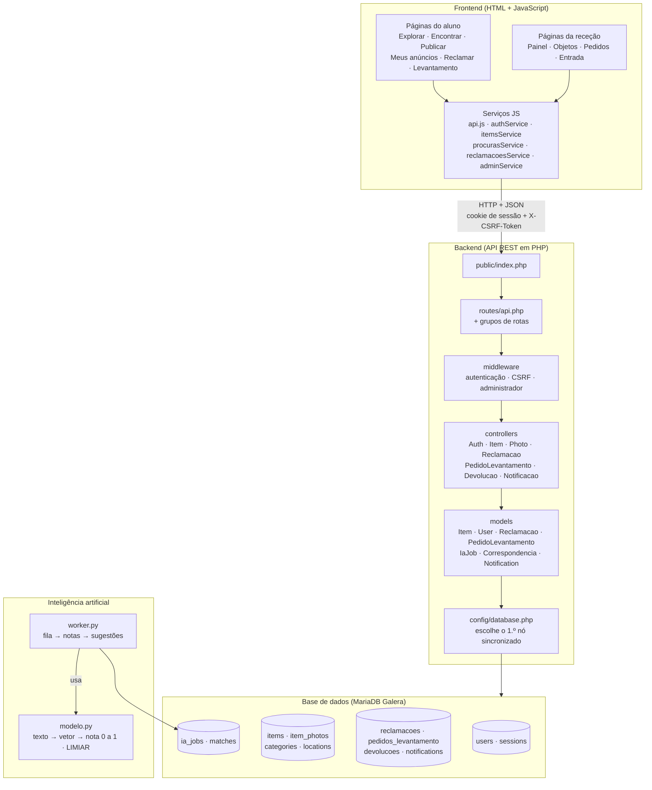

# 2. Componentes

```mermaid
flowchart TB
    subgraph FE["Frontend (HTML + JavaScript)"]
        direction LR
        P1["Páginas do aluno<br/>Explorar · Encontrar · Publicar<br/>Meus anúncios · Reclamar · Levantamento"]
        P2["Páginas da receção<br/>Painel · Objetos · Pedidos · Entrada"]
        SV["Serviços JS<br/>api.js · authService · itemsService<br/>procurasService · reclamacoesService · adminService"]
        P1 --> SV
        P2 --> SV
    end

    subgraph BE["Backend (API REST em PHP)"]
        direction TB
        IDX["public/index.php"] --> RT["routes/api.php<br/>+ grupos de rotas"]
        RT --> MW["middleware<br/>autenticação · CSRF · administrador"]
        MW --> CT["controllers<br/>Auth · Item · Photo · Reclamacao<br/>PedidoLevantamento · Devolucao · Notificacao"]
        CT --> MD["models<br/>Item · User · Reclamacao · PedidoLevantamento<br/>IaJob · Correspondencia · Notification"]
        MD --> DB_PHP["config/database.php<br/>escolhe o 1.º nó sincronizado"]
    end

    subgraph BD["Base de dados (MariaDB Galera)"]
        T1[("users · sessions")]
        T2[("items · item_photos<br/>categories · locations")]
        T3[("reclamacoes · pedidos_levantamento<br/>devolucoes · notifications")]
        T4[("ia_jobs · matches")]
    end

    subgraph IAG["Inteligência artificial"]
        MOD["modelo.py<br/>texto → vetor → nota 0 a 1 · LIMIAR"]
        WRK["worker.py<br/>fila → notas → sugestões"]
    end

    SV -- "HTTP + JSON<br/>cookie de sessão + X-CSRF-Token" --> IDX
    DB_PHP --> BD
    WRK --> T4
    WRK -- "usa" --> MOD
```
