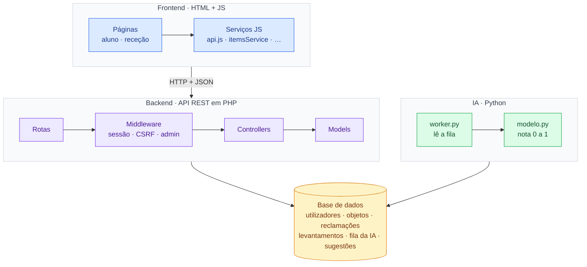

# 2. Componentes

Cada camada só fala com a de baixo. O frontend chama a API por HTTP + JSON; a API e a IA partilham a base de dados.

```mermaid
flowchart TB
    subgraph FE["Frontend · HTML + JS"]
        direction LR
        PG["Páginas<br/>aluno · receção"] --> SV["Serviços JS<br/>api.js · itemsService · …"]
    end

    subgraph BE["Backend · API REST em PHP"]
        direction LR
        RT["Rotas"] --> MW["Middleware<br/>sessão · CSRF · admin"] --> CT["Controllers"] --> MD["Models"]
    end

    subgraph IA["IA · Python"]
        direction LR
        WK["worker.py<br/>lê a fila"] --> MO["modelo.py<br/>nota 0 a 1"]
    end

    BD[("Base de dados<br/>utilizadores · objetos · reclamações<br/>levantamentos · fila da IA · sugestões")]

    FE -- "HTTP + JSON" --> BE
    BE --> BD
    IA --> BD

    classDef app fill:#ede9fe,stroke:#7c3aed,color:#4c1d95
    classDef entrada fill:#dbeafe,stroke:#2563eb,color:#1e3a8a
    classDef dados fill:#fef3c7,stroke:#d97706,color:#78350f
    classDef ia fill:#dcfce7,stroke:#16a34a,color:#14532d
    class PG,SV entrada
    class RT,MW,CT,MD app
    class WK,MO ia
    class BD dados
    style FE fill:#f9fafb,stroke:#d1d5db,color:#374151
    style BE fill:#f9fafb,stroke:#d1d5db,color:#374151
    style IA fill:#f9fafb,stroke:#d1d5db,color:#374151
```
